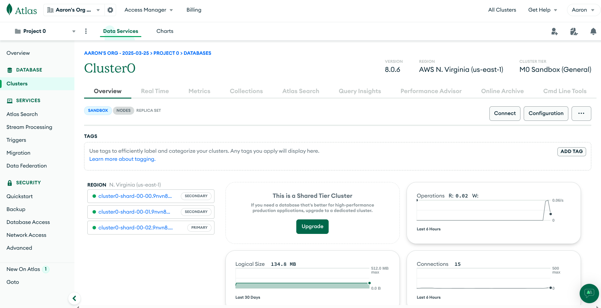

# Aaron Wang - CS:3980 - Assignment 3

## Atlas Cluster
For this assignment, I set up an Atlas account and created "Project0", with a free cluster named "Cluster0" 

## Collections
This cluster comes with the sample collection, "sample_mflix", which has the database, "movies"

## Compass

I also installed Compass and connected to my Atlas Cluster.

## "movies" Database

The "movies" database can be seen on Compass. On this view, mongosh is accessible through "Open MongoDB shell". Below are the two queries made according to the assignment instructions.

## Query 1

## Query 2

